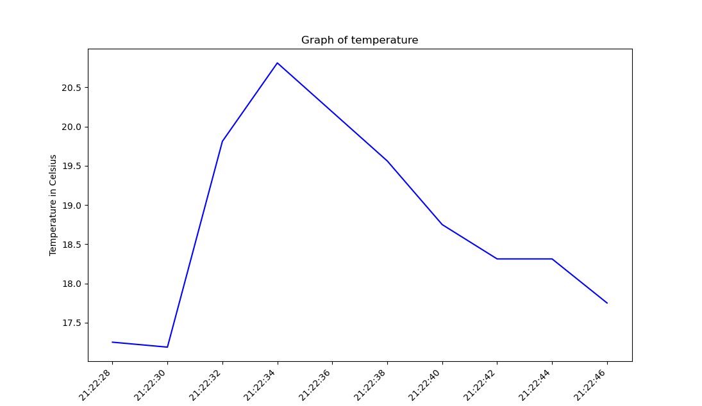
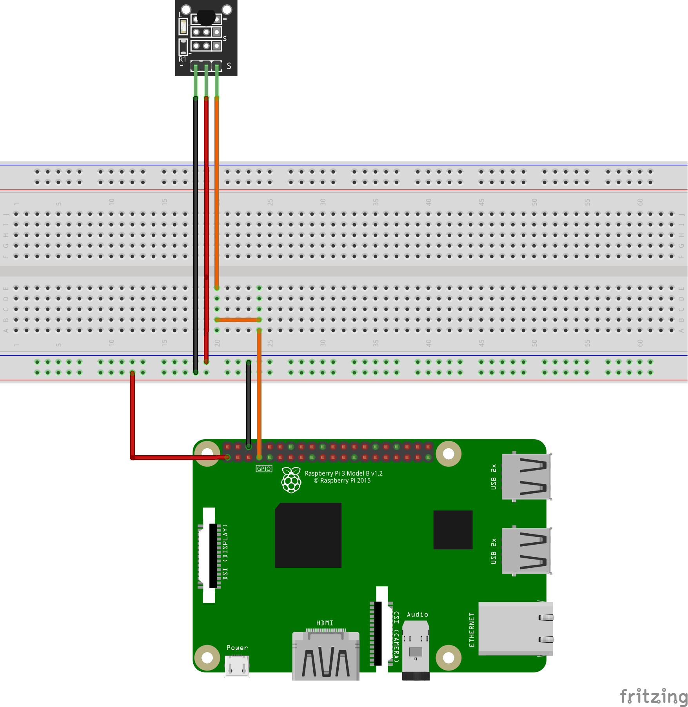
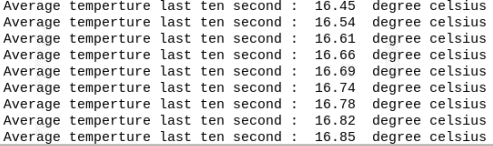

# Tempsensor-RealtimeGraph
KY-001 with real-time Matplotlib

## The requirement 
- Pigpio -> serve control
- Matplotlib and Numpy -> create the polar chart
- RPi.GPIO -> control SR04 (Ultrasonic sensor)

  

## Wiring diagram

  

## Result

